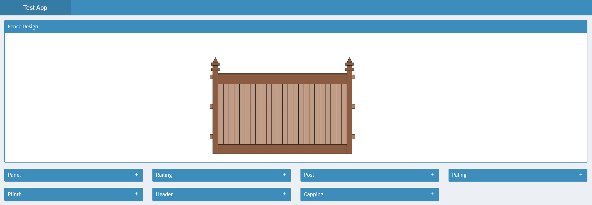
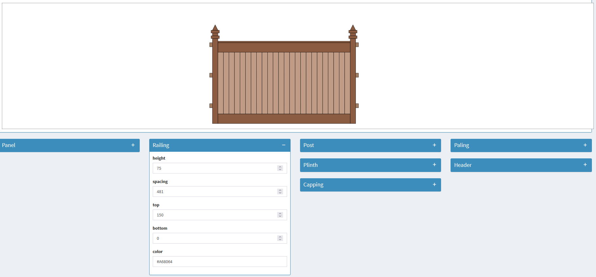
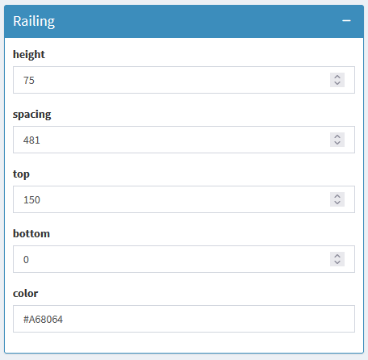
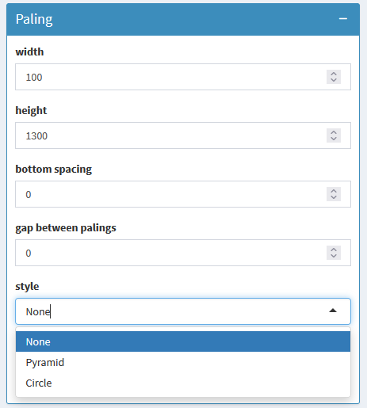
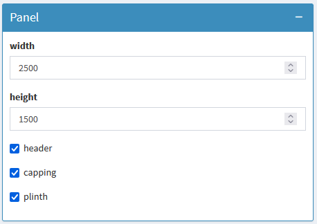

# Panel Designer

Specifications are used to drive the designer, which are either provided by the user through the shiny UI or calculated based on input provided by the user coupled with business logic defined in the backend.

A fence panel is composed of 7 components, one being the main panel, which is then composed of 6 components:

1. Railings
2. Posts
3. Palings
4. Plinth
5. Header
6. Capping

### Designer preview

Users can provide input to the designer using the dropdown boxes below the designer panel. Any updates provided by the user are reflected instantly in the designer panel, allowing users to play with the design and see updates as they make changes.

### Dropdown boxes

Things such as the number of palings, the number of railings, the space between railings, the width of the panel, spacing between palings, and other such things are controlled by business logic in the backend based on user input and then reflected in the panel designer shown to the user.

Dropdown boxes are using a variety of different input options, such as:

- numericInput
- textInput
- selectInput
- checkboxInput

### Other sources of information:

https://github.com/scalable-software/r.shiny

This repository aims to introduce users to R Shiny by providing a step-by-step guide on how to install R Shiny and get an R Shiny package running locally. It also covers the software architecture of how Renopilot is using R Shiny and its interaction with enterprise-level development.

https://github.com/scalable-software/r.package

This repository serves as a boilerplate for creating new R packages, offering a basic package structure along with essential files to help you get started. It includes a unit testing framework using testthat, a documentation framework using roxygen2, and GitHub Actions for CI/CD. The repository also provides detailed instructions on how to utilize the template and set up the file structure efficiently.

